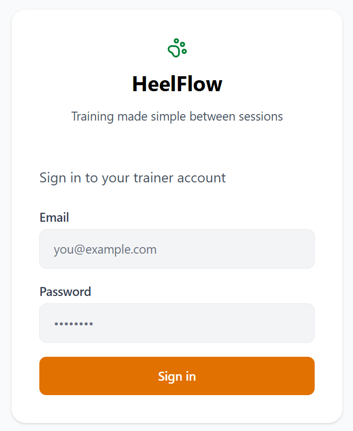
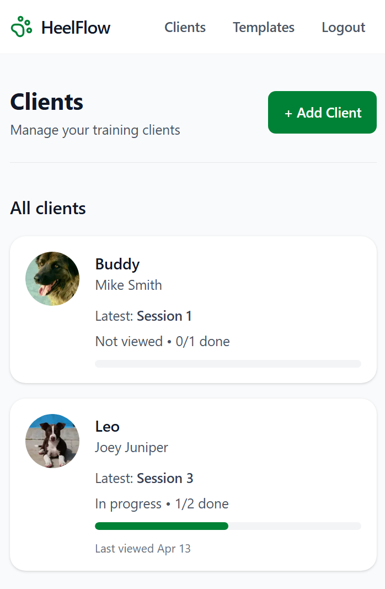
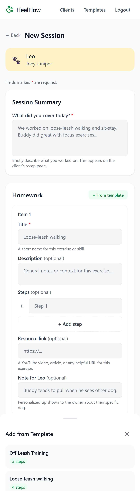
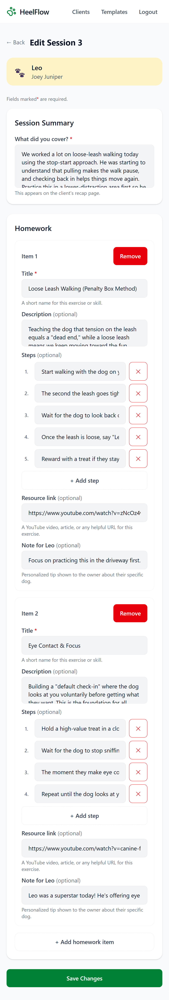

# HeelFlow

HeelFlow is a mobile-first dog training follow-up app for private trainers.

It helps trainers turn each session into a clear, structured plan so clients know exactly what to practice between lessons — without needing to log in.

---

## Overview

Dog training often breaks down between sessions.

A trainer may explain what to work on in person, but once the lesson ends:

- clients forget the details
- practice instructions get lost in texts or memory
- trainers have no visibility into whether homework was actually viewed or followed through on

HeelFlow solves that gap by turning each session into a shareable recap with structured homework, progress tracking, and lightweight follow-up.

---

## The Problem

Private trainers need a simple way to reinforce what happens after the lesson.

Without a clear follow-up workflow:

- clients forget what to practice
- instructions become inconsistent
- progress between sessions is harder to measure
- trainers lose a valuable chance to improve retention and follow-through

---

## The Solution

HeelFlow turns every session into a clear, trackable workflow:

1. **Trainer creates a session recap**
   - summary
   - homework items
   - step-by-step instructions
   - optional resource links
   - dog-specific notes

2. **Client receives a shareable recap page**
   - no login required
   - mobile-friendly
   - easy to review after the session

3. **Client works through homework**
   - marks items complete
   - views linked resources
   - sends follow-up questions

4. **Trainer sees engagement**
   - whether the recap was viewed
   - whether homework is in progress or complete
   - which clients may need follow-up

---

## Core Features

### Trainer Dashboard

- view all clients in one place
- see latest session engagement at a glance
- identify clients who may need follow-up
- track homework completion progress per session

### Client Detail

- view a client's session history
- review session engagement and follow-through
- send and review follow-up messages
- copy public recap links
- archive clients without losing history

### Session Creation

- create a structured session recap
- add multiple homework items
- include:
  - title
  - description
  - step-by-step instructions
  - resource links
  - dog-specific notes
- reuse templates to speed up repeat workflows

### Session Editing

- safely update an existing recap
- preserve client progress when possible
- support real-world trainer workflows where instructions evolve after the session

### Public Client Recap Page

- no login required
- shareable magic link (`/s/[token]`)
- clear recap summary
- homework checklist with progress tracking
- resource links and personalized notes
- follow-up messaging
- lightweight review CTA

### Homework Templates

- create reusable homework templates
- speed up repeated lesson types
- keep workflows efficient without sacrificing flexibility

### Engagement Tracking

Tracks:

- first view
- last view
- homework completion state

Derived engagement states:

- Not viewed
- Viewed
- In progress
- Completed

---

## Why It Matters

HeelFlow is not a marketplace, social app, or booking platform.

It is a focused workflow tool built around one core problem:

**making training actually happen between sessions.**

The product is designed to reduce client friction, give trainers more visibility, and create a clearer follow-through loop after every lesson.

---

## Screenshots

### Login



### Trainer-Dashboard



### Client-Detail


### New Session



### Edit Session



### Public Client Recap


---

## Tech Stack

- **Next.js (App Router)**
- **TypeScript**
- **Tailwind CSS**
- **Supabase**
  - Postgres
  - Auth
  - Storage

---

## Project Structure

```txt
app/
  (trainer)/
    dashboard/
    clients/
    sessions/
    templates/
  s/[token]/        # public client recap page

lib/
  supabase/
  sessions/

components/
  shared UI and feature components
```

---

## Product Principles

**Mobile-first**
The client experience is designed primarily for phone use immediately after or between training sessions.

**Low client friction**
Clients should not need an account just to review what to work on.

**Workflow over noise**
Everything centers around the same core loop: session → homework → follow-through

**Real-world trainer behavior**
Edits, templates, progress, and archiving are designed around how trainers actually work, not idealized CRUD flows.

---

## Current Status

MVP includes:

- trainer login
- client dashboard
- session creation
- session editing
- homework templates
- public recap pages
- progress tracking
- follow-up messaging
- engagement visibility
- client archiving

---

## Future Opportunities

Potential next steps include:

- richer engagement insights
- reminder / notification flows
- stronger review conversion
- deeper trainer follow-up workflows
- expanded session analytics
